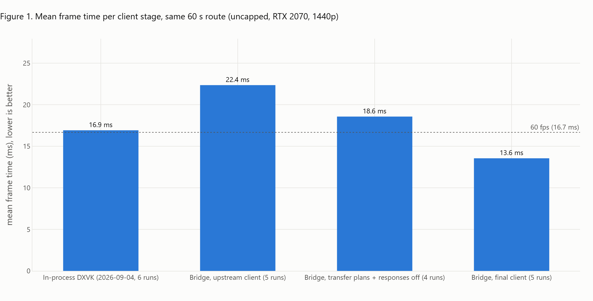
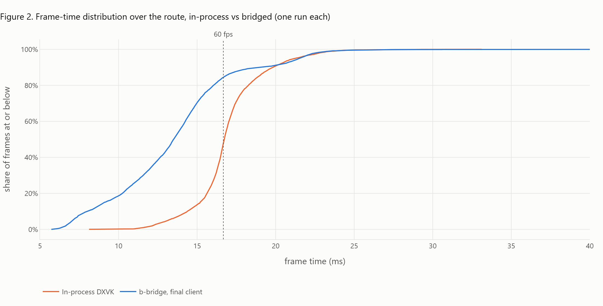
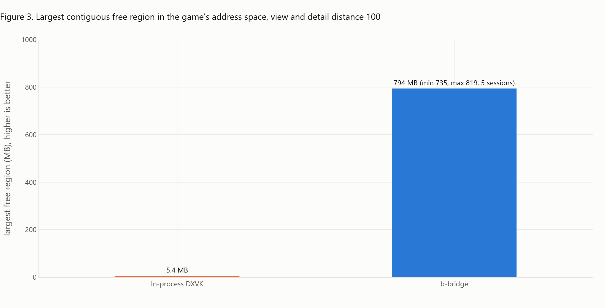
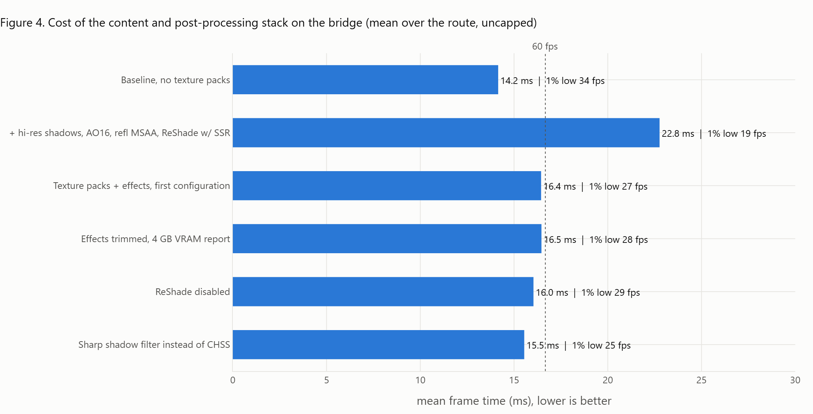
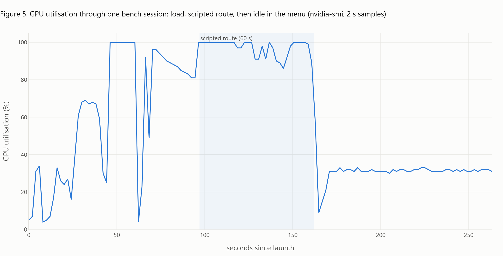
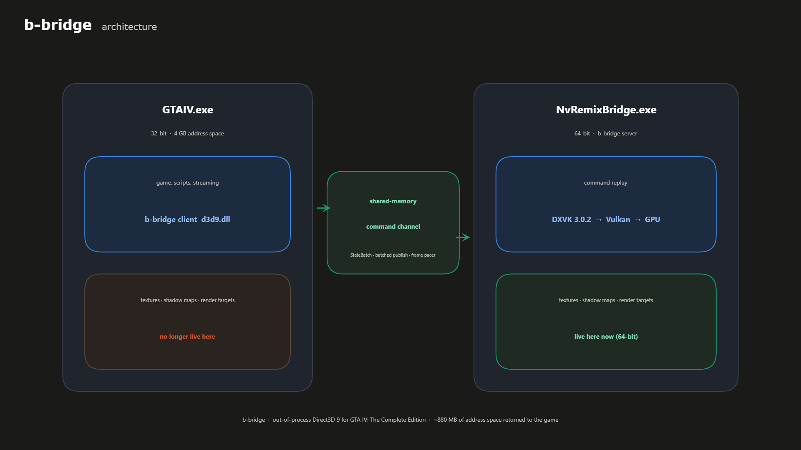

# b-bridge: out-of-process Direct3D 9 for GTA IV

https://www.nexusmods.com/gta4/mods/1385

**Out-of-process Direct3D 9 rendering for Grand Theft Auto IV: The Complete Edition.**
A research release. Fork of NVIDIA's [bridge-remix](https://github.com/NVIDIAGameWorks/bridge-remix).

## Abstract

GTA IV is a 32-bit process. Every resource the graphics driver allocates on the game's behalf
(textures, shadow maps, render targets, staging buffers) is mapped into the same 4 GB address
space as the game's own data, and a heavily modded install exhausts that space long before it
exhausts RAM or VRAM. b-bridge moves the entire Direct3D 9 device into a separate 64-bit
process. The game keeps a thin 32-bit `d3d9.dll` that forwards every call over a shared-memory
channel to a 64-bit server, which renders through DXVK on Vulkan. On the test system this
returned about 880 MB of address space to the game and held frame time at parity with
in-process DXVK, allowing a 5 GB texture-pack stack to run where the same install previously
crashed within minutes.

## Problem

The address-space wall, not memory, is the practical ceiling on GTA IV modding. Prior
approaches (large-address-aware flags, streaming-budget tuning, the `-nomemrestrict` family,
texture-memory caps in DXVK) reduce pressure but cannot change the fact that driver
allocations and game allocations share one 32-bit space. Measured on the reference install
before this work: largest contiguous free region as low as 5 MB with view distance at 100,
and a streaming-allocator crash band at 2.8 to 3.0 GB committed.

## Method

The IPC layer of NVIDIA RTX Remix already marshals D3D9 across processes; its purpose there is
to feed a path tracer. b-bridge keeps the transport and discards the renderer: the server
loads an unmodified DXVK 3.0.2 instead of the Remix runtime, and the client is tuned for a game
that issues 15,000 to 70,000 D3D9 calls per frame.

Changes against upstream (all in `src/`):

| Area | Change | Config key |
|---|---|---|
| Client | Frame pacer: waitable timer plus spin, so pacing happens in the game process rather than the server | `clientFrameCap` |
| Client | State-block transfer plans: precomputed dirty index lists for the `D3DSBT_ALL` blocks GTA IV applies ~475 times per frame | - |
| Client | StateBatch: render, sampler and stage state, textures, shaders, streams and shader constants packed into one record per flush | `clientStateBatch` |
| Client | Batched command index publish | `clientCmdPublishBatch` |
| Client | Merged device/channel lock; import-free spinlock, so ASI loaders that hook `kernel32` cannot re-enter it | - |
| Client | Per-window wait statistics in `bridge32.log`; assert logger no longer dereferences a dead channel | - |
| Server | StateBatch replay with the same resource lookups as the individual commands | - |
| Server | Vanilla-DXVK mode as the supported configuration | `server.useVanillaDxvk` |
| Both | Server responses only for calls that return data | `sendAllServerResponses` |

## Results

Reference system: Intel i7-9700K, NVIDIA GeForce RTX 2070 (8 GB), driver 610.74, 2560x1440 borderless,
GTA IV CE 1.2.0.59 with FusionFix. Frame times are means over a fixed 60-second scripted drive
(uncapped), memory figures from an in-process address-space monitor at view and detail distance 100.
The in-process and client-stage runs were taken at view distance 70; the texture-pack row at 100.

| Configuration | Mean frame time | Largest free region |
|---|---|---|
| In-process DXVK, same route (6 runs) | 16.9 ms | 5 MB at view 100 |
| b-bridge, upstream client (5 runs) | 22.4 ms | ~800 MB |
| b-bridge, transfer plans + responses off (4 runs) | 18.6 ms | ~800 MB |
| b-bridge, final client (5 runs) | 13.6 ms | ~800 MB |
| b-bridge, final client, 5 GB texture-pack stack | 16.4 ms | 735 to 819 MB |

The batching work is what brings the bridged frame time below the in-process figure; the
transport itself costs time, and the client hides it by sending fewer, larger messages.

Interactive versions of these figures are in [docs/figures.html](docs/figures.html); the script that
produces them from the bench CSVs is [docs/make_figures.py](docs/make_figures.py).

A presentation set (dark theme, 3D ridges, address-space terrain, per-run scatter) and the architecture
diagram live in [docs/figures_pr/](docs/figures_pr/), interactive in [docs/figures_pr.html](docs/figures_pr.html),
from [docs/make_figures_pr.py](docs/make_figures_pr.py).

A 73-second explainer animation (Manim) is on YouTube at https://youtu.be/9QZ2xTVJpNg and attached to the
v0.1.0 release as `b-bridge_explainer.mp4`; the source is [docs/video/explainer.py](docs/video/explainer.py).

## Limitations

These are the boundaries of what was tested. Nothing outside them should be assumed to work.

- **Measured on NVIDIA only.** Every number above was taken on one RTX 2070 with one driver
  version. Users have since run the build on AMD (Radeon 680M, RDNA2, Windows 11) and on Intel
  Arc B580 under Linux with Proton and Mesa ANV ([#2](https://github.com/gutbash/b-bridge/issues/2),
  [#3](https://github.com/gutbash/b-bridge/issues/3)). Those are reports that it runs, not
  measurements: no frame-time or address-space figures exist from either system.
- **One machine, one configuration.** One CPU, one resolution and refresh rate, borderless
  windowed only. Exclusive fullscreen is disabled by the shipped `dxvk.conf` because the mode
  switch loses the device across the process boundary.
- **One game build and one mod stack measured.** GTA IV CE 1.2.0.59 with FusionFix loaded
  through an ASI loader. Users report 1.0.7.0, 1.0.8.0 and other 1.2.0.x builds working, and
  1.0.4.0 not working; the 1.0.4.0 failure has not been investigated. FusionFix loaded through
  its own `d3d9.dll` is untested.
- **Raster only.** GTA IV is a deferred renderer and the Remix path-traced pipeline does not
  produce a usable image with it. That pipeline is not shipped.
- **CPU-bound scenes do not improve.** Every D3D9 call still crosses the process boundary.
  The gain is address space; frame time is held at parity, not reduced, in scenes limited by
  the game's render thread.
- **Startup desync, about one launch in ten.** The server process never comes up, its log is
  not written, and the client exits after 12 seconds. Relaunching succeeds. The cause is in
  process launch or the initial channel handshake and is not yet isolated.
- **First device creation fails on every launch.** `bridge64.log` shows one failed `CreateDevice`
  (0x8876086c) before the real device is created. This is the game probing with a zero refresh
  rate and is harmless; it is listed here so it is not reported as a fault.
- **Overlays on the server side get no input.** A ReShade Vulkan layer in the server renders
  correctly but its overlay and hotkeys are dead, because the window belongs to the game
  process. Such tools must be configured by file.
- **DXVK 3.0.2 is what ships and what was measured.** A user reports vanilla DXVK 3.1 dropped
  in as `.trex\d3d9vk_x64.dll` running for multi-hour sessions on both the Intel and AMD systems
  above. Not validated here.
- **Session length.** The longest measured session is about 25 minutes. A user reports a 16-hour
  session (14 of them idle in the pause menu) with no texture loss on the Intel Arc system; that is
  a report, not a measurement.
- **Resolution list.** The server's DXVK lists only the desktop mode, its 60 Hz variant and six
  standard fallbacks, because GTA IV overruns a fixed-size array when a driver advertises over a
  hundred modes. 0.1.0 also forced a 16:9 aspect filter, which removed the desktop mode itself on
  16:10 displays; 0.1.1 drops it. A mode that is not the current desktop mode is not listed, and
  that includes DSR and DLDSR resolutions: launching with the game set to one gives a black screen
  and a crash ([#1](https://github.com/gutbash/b-bridge/issues/1)). Set the desktop to that
  resolution before launching (the reporter scripted it with `qres`) and back afterwards.

## Reproducibility

The benchmark route, the address-space monitor and the census scripts used for the results are
part of the reference install's tooling rather than this repository; the numbers above should be
read as one system's measurements, not as a specification. Anyone reproducing them should
report GPU, driver, resolution, the mean and 1% low over a fixed route, and the minimum largest
free region over the session.

## Future work

- Isolate and fix the startup desync.
- Measure on AMD and Intel Vulkan drivers, where users report it running.
- Find out why 1.0.4.0 does not work.
- Give a server-side ReShade its overlay and hotkeys back, which needs input forwarded from the
  game window to the server.
- Reduce per-call client overhead further; the render thread still spends a measurable share
  of its time in the client wrapper.
- Characterise multi-hour sessions.

## Installation

See [INSTALL.md](INSTALL.md). Changes by version are in [CHANGELOG.md](CHANGELOG.md).

## Building

Meson and ninja with MSVC 14.42. `build_x86_release.cmd` builds the client, `build_x64_release.cmd`
the server. `b_ndebug=true` is required: without it `bridge_cast` falls back to `dynamic_cast`
with live asserts and the client is several milliseconds slower per frame.

## License

MIT, as upstream. See `LICENSE-MIT` and `ThirdPartyLicenses.txt`. DXVK is zlib-licensed and
redistributed unmodified. The upstream README is preserved as `README.upstream.md`.

The name is short for Broker Bridge, after the bridge in Liberty City. The client brokers the calls; the bridge is the shape.
